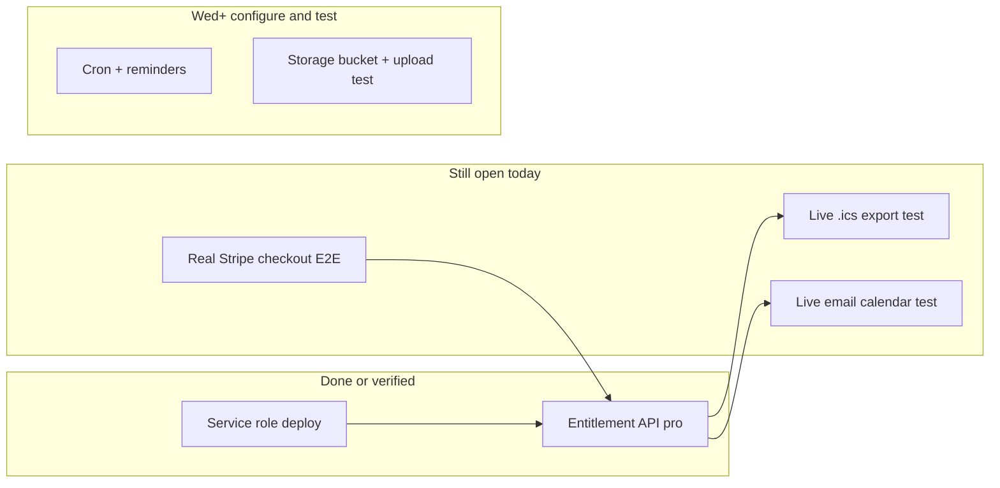

# GreenGPT workflow accuracy and task completion

## Is the attachment accurate?

**Mostly yes for Tuesday (Jun 3), partially ahead on code, behind on verification.**

The timeline correctly prioritizes Phase 1 (billing + entitlement). It understates how much is **already built in the repo** for Wed–Thu (reminders cron, document APIs, `DocumentUploader`, enterprise tier mapping). Those days are better framed as **configure + test**, not greenfield build.

---

## Tuesday — Finish Phase 1 (Jun 3)

| Task in attachment | Accurate? | Status | Evidence |
|-------------------|-----------|--------|----------|
| Commit + push `getSupabaseAdmin` → Vercel deploy | Yes | **Complete** | Commit `5588a39` pushed to `main`; production entitlement responded after deploy |
| Update Supabase row to lowercase email | Yes (was a real issue) | **Complete** (functional) | Production `GET /api/billing/entitlement?email=dylanbrown416@gmail.com` returns `{"tier":"pro","status":"active",...}`; mixed-case query also works |
| Verify entitlement API on production | Yes | **Complete** | Verified post-deploy (not just local) |
| Test .ics export + Email my calendar as Pro | Yes — still the right next step | **Not complete** | No production UI test recorded; [`GREENGPT_BUILD_CHECKLIST.md`](GREENGPT_BUILD_CHECKLIST.md) lines 67–83 still unchecked |

**Mark complete in your workflow UI:** first three Tuesday bullets. **Leave open:** fourth bullet until you run the live site tests below.

### How to finish the fourth Tuesday task (~20 min)

On **https://greengptadvisory.com** (hard refresh):

1. Enter **`dylanbrown416@gmail.com`** in the calendar email field (or confirm `ehs_calendar_email` in DevTools → Application → Local Storage).
2. Confirm UI shows Pro unlocked (e.g. “Pro access confirmed” in [`EHSCalendarLanding.tsx`](src/app/components/ehs-calendar/EHSCalendarLanding.tsx)).
3. Generate calendar → **Export .ics** → open file in Outlook/Google Calendar.
4. **Email my calendar** → check inbox for `.ics` (requires `RESEND_*` on Vercel).
5. Optional: repeat export/email **without** Pro row or as free tier → expect upgrade/block.

Routes involved: [`src/app/api/ehs-calendar/export/route.ts`](src/app/api/ehs-calendar/export/route.ts), [`src/app/api/ehs-calendar/email/route.ts`](src/app/api/ehs-calendar/email/route.ts) (both use `requireProEmail` + `getSupabaseAdmin`).

---

## Right sidebar progress (4 items)

| Item | Attachment shows | Actual status | Notes |
|------|------------------|---------------|-------|
| 1. Testing checkout flow | Open | **Not complete** | Entitlement works via **manual/test row**; **real** Stripe checkout → webhook → new Supabase row not confirmed in this project |
| 2. Generator gating — not needed | Checked | **Complete (code)** | `startProLocal` removed; gating lives in [`EHSCalendarLanding.tsx`](src/app/components/ehs-calendar/EHSCalendarLanding.tsx) via `/api/billing/entitlement` |
| 3. Add all env vars to Vercel and deploy | Open | **Partial** | Deploy done; entitlement success implies `SUPABASE_URL` + `SUPABASE_SERVICE_ROLE_KEY` on Vercel. You should still **audit** full list in [`.env.example`](.env.example) / [`docs/DEPLOY.md`](docs/DEPLOY.md): Stripe live keys, `STRIPE_WEBHOOK_SECRET`, `NEXT_PUBLIC_APP_URL`, `RESEND_*`, `CRON_SECRET`, OpenAI if using RAG |
| 4. Verify end-to-end on production | Open | **Not complete** | Blocked on: live checkout + .ics + email + (optional) webhook 200 in Stripe Dashboard |

**Mark complete:** item 2 only. **Mark partial or keep open:** item 3 until you screenshot/confirm all Vercel vars. **Keep open:** items 1 and 4 until Stripe + UI tests pass.

### Real checkout E2E (closes sidebar 1 + 4)

1. Production: Upgrade to Pro → pay with test/live card per your Stripe mode.
2. Stripe Dashboard → Webhooks → `checkout.session.completed` → **200** on `/api/billing/webhook`.
3. Supabase `subscriptions` → **new row**, lowercase email, `tier=pro`, `status=active`.
4. Return to `/?billing=success` → Pro unlocks without manual SQL.

---

## Wednesday–Sunday in attachment vs codebase

### Wednesday — Enterprise gating + Reminders

| Planned task | Code status | Your “complete” when |
|--------------|-------------|----------------------|
| Enterprise gating UI | **Built** — webhook maps `STRIPE_ENTERPRISE_PRICE_ID`; Landing uses `isEnterpriseTier` / `hasProAccess` | Manual Supabase row `tier=enterprise` or test subscription; confirm UI |
| Vercel Cron for reminder job | **Built** — [`vercel.json`](vercel.json) → `/api/reminders/send` daily 13:00 UTC | `CRON_SECRET` set on Vercel; manual `POST` with `Authorization: Bearer <secret>`; optional fake deadline test per checklist |
| Wire sync-reminders on generate | **Built** — `useEffect` on step 3 + export/email in [`EHSCalendarLanding.tsx`](src/app/components/ehs-calendar/EHSCalendarLanding.tsx) ~385–390, 377, 330 | Pro user generates calendar → row in `deadline_reminders` |

**Do not treat Wednesday as “build from scratch”—treat as test + env.**

### Thursday — Document attachments

| Planned task | Code status | Your “complete” when |
|--------------|-------------|----------------------|
| Upload/list APIs | **Built** | — |
| Attachment UI per obligation | **Built** — [`DocumentUploader.tsx`](src/app/components/DocumentUploader.tsx) in Landing | — |
| Storage bucket `obligation-files` | **Manual Supabase step** | Checklist line 117 still `[ ]` — create private bucket in Dashboard |
| Upload test | **Not verified** | Upload PDF as Pro → row in `obligation_documents` + file in Storage |

### Friday — Content + multi-facility

| Planned task | Status |
|--------------|--------|
| Project photos / case studies | **Done (static)** — `/projects` gallery; CMS upload **deferred** per checklist |
| Multi-facility switcher | **Deferred** post-launch |
| ISO docs to RAG | Separate from EHS calendar Phase 1; not blocking Tuesday |

### Saturday / Sunday

Accurate as buffer + QA. [`docs/DEPLOY.md`](docs/DEPLOY.md) smoke list still mostly unchecked except entitlement.

---

## [`GREENGPT_BUILD_CHECKLIST.md`](GREENGPT_BUILD_CHECKLIST.md) sync

The repo checklist is **more honest** than the attachment: many Phase 1 env/E2E items are still `[ ]` even though code exists. After you finish tests, update checkboxes for:

- Phase 1: Tests 1–5 (lines 32–36) — at minimum Test 4–5 and export/email sections (67–83)
- [`docs/DEPLOY.md`](docs/DEPLOY.md): entitlement `[x]`, rest after smoke tests

---

## Recommended checkbox updates (your Cowork timeline)

**Check now:**

- Commit + push service role fix / Vercel deploy
- Lowercase email (or equivalent — entitlement proves lookup works)
- Verify entitlement API on production
- Generator gating — confirmed not needed

**Leave unchecked until you run tests:**

- Test .ics export + Email my calendar (Tuesday bullet 4)
- Testing checkout flow (sidebar 1)
- Verify end-to-end on production (sidebar 4)
- Add all env vars to Vercel (sidebar 3) — check when you confirm full env audit, not only deploy

**Wednesday onward:** keep on calendar but label as **test/configure**, not **implement**—implementation for reminders, documents, and enterprise mapping is already in the tree.

---

## Single priority for “today” (matches attachment footer)

You are past the **deploy + entitlement** blocker. The only Phase 1 work left today is **live Pro UX verification** (export + email) and optionally **one real Stripe checkout** to close E2E. Everything else in the image is correctly scheduled for later days or is already coded.
